<div align="right">
    
</div>

# REDSA for CAVs

## *A Reliable and Efficient Detection of Sensor Attacks for Connected & Autonomous Vehicles*

<div align="right">
    *Release 0.0.2*
</div>

<div align="right">
    31 August 2022
</div>

#### REDSA is a project which explores *Lidar-based Perception Models*, testing its resillience by to attempting to launch various attacks such as [Object Removal Attacks][1], [Object Spoofing][2] and a state of the art Distributed Object Removal Attack (D-ORA). Defence techniques are also tested, namely [Shadow-Catcher][3] as described by Hau et al.


*This project utilises [Open3D-ML][4] and the [KITTI Dataset][5] for simulating 3-dimensional LiDAR Frames. Also explores [PointPillar][6] (and [PointRCNN][7]) as the object detection models.*

<div align='center'>
    
</div>

## Table of Content
* [Getting Started](#getting-started)
* [Sample Datasets](#sample-datasets)
    * Kitti 3D Object Dataset
    * Adversarial Datasets
* [Object Detection](#object-detection)
* [Attacks](#attacks)
    * Object Removal (ORA)
    * Spoofed Attacks
    * Distributed Object Removal (D-ORA)
* [Defences](#defences-shadow-catcher)


## Getting started
**Dependencies** ***(Tested on Python 3.9):***
* Pytorch
* Open3D
* Open3D-ML

*All dependencies are located in 'requirements.txt' (using pipenv)*

```bash
# Clone this repo and start a new virtual environment
pipenv shell
# If dependencies didn't automatically install, use:
pipenv install -r requirements.txt
```

## File Structure

```
REDSA_CAVs
 |- configs # Contains Configuration Files for PointPillars & PointRCNN
 |
 |- pretrained_ckpt # Pre-trained Model Weights
 |
 |- sample_datasets # Sample Kitti Datasets & Adversarial Point Cloud Data
 |
 |- scripts # (see below)
 |
 |- requirements.txt # List of Dependencies 
```

***
## Sample Datasets 
This project essentially uses 3 samples from [Kitti 3D Object Detection](http://www.cvlibs.net/datasets/kitti/eval_object.php?obj_benchmark=3d) Training Split [000035, 000134, 000200] found in */sample_datasets/KITTI/training*. A Raw Kitti City Sequence '2011_09_26_drive_0005' is also found in */sample_datasets/0005*. We also include 14 adversarial samples which are derived from the 3 Kitti 3D Object Detection dataset.

### Kitti 3D Object Detection Dataset
```
KITTI
 |- training
        |- calib    # Calibration Files
        |    |- 000035.txt
        |    |- ...
        |- image_2  # Rectified Camera Image
        |    |- 000035.png
        |    |- ...
        |- label_2  # Ground Truth Labels
        |    |- 000035.txt
        |    |- ...
        |- Velodyne # Point Cloud Data
             |- 000035.bin
             |- ...
```

### Adversarial Kitti Samples

```
Adv_Kitti
 |- training
        |- calib    # Calibration Files
        |    |- 0000.txt
        |    |- ...
        |- label_2  # Ground Truth Labels
        |    |- 0000.txt
        |    |- ...
        |- Velodyne # Point Cloud Data
             |- 0000.bin ----
             |- 0001.bin    |
             |- 0002.bin    |__ # Contains PCD of Spoofed 
             |- 0003.bin    |   # Objects at the Front-near 
             |- 0004.bin    |   
             |- 0005.bin ----
             |- 0006.bin ----   
             |- 0007.bin    |
             |- 0008.bin    |-- # Contains PCD after ORA 
             |- 0009.bin    |
             |- 0010.bin ----
             |- 0011.bin ----
             |- 0012.bin    |-- # Contains PCD after D-ORA
             |- 0013.bin ----
```

***

## Object Detection

Object detection scripts are found in */scripts/object_detection/*

*Note that PointRCNN requires CUDA*

```
# File Structure
object_detection
    |- objdet_rawKitti_seq.py       # Run PointPillar / PointRCNN on Raw
    |                               # Kitti Data Sequence
    |
    |- objdet_rawKitti_frame.py     # Run PointPillar / PointRCNN on Raw
    |                               # Kitti Data Frame 
    |
    |- objdet_Kitti_frame.py        # Run PointPillar / PointRCNN on 
    |                               # Object Detection 3D Kitti Dataset 
    |                               # (single frame) and Visualizes GT 
    |                               # and Prediction Boxes 
    |
    |- objdet_results.py            # Evaluating Prediction Results 
                                    # (Conf. Score, IoU, mAP) on specific 
                                    # Kitti Frame
```

#### Usages:

```zsh
(virtual_env) $python scripts/object_detection/objdet_rawKitti_seq.py --help
# Sample Usage:
objdet_rawKitti_seq.py  --model ['PointPillars', 'PointRCNN']
                        --dataset_path './sample_datasets/0005'
                        [--cam2cam_calib_path]
                        [--velo2cam_calib_path]
                        [--config_path]
                        [--ckpt_path] [--device, default='cpu']

(virtual_env) $python scripts/object_detection/objdet_rawKitti_frame.py --help
# Sample Usage:
objdet_rawKitti_frame.py --model ['PointPillars', 'PointRCNN']
                         --dataset_path './sample_datasets/0005' 
                         --frame [0: 000035, 1: 000134, 2: 000200]
                         [--fv, default=1] # For Visualising FV Only
                         [--cam2cam_calib_path]
                         [--velo2cam_calib_path] 
                         [--config_path]
                         [--ckpt_path] [--device, default='cpu']

(virtual_env) $python scripts/object_detection/objdet_Kitti_frame.py --help   
# Sample Usage:
objdet_Kitti_frame.py --model ['PointPillars', 'PointRCNN'] 
                      --dataset_path './sample_datasets/KITTI' 
                      --frame [0: 000035, 1: 000134, 2: 000200]
                      [--config_path]
                      [--ckpt_path] [--device, default='cpu']
```

Sample GUI for predictions on Frame 1 (000134):

```bash
$ python scripts/object_detection/objdet_Kitti_frame.py --model 'PointPillars' --dataset_path './sample_datasets/KITTI' --frame 1 --config_path ./configs/pointpillars.yml --ckpt_path ./pretrained_ckpt/pointpillars.pth --device 'cpu'
```

<div align="center">
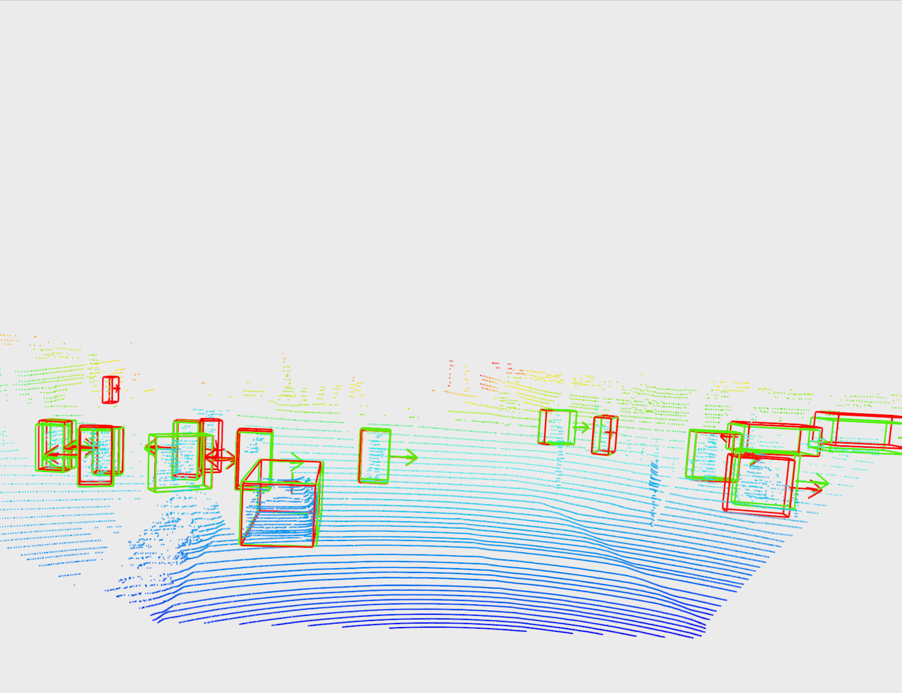 
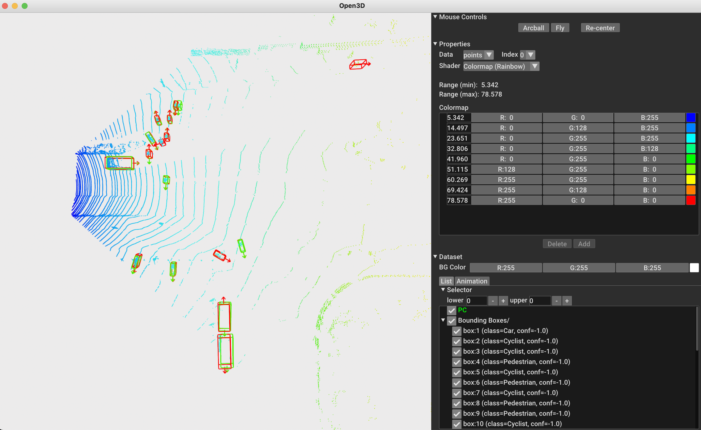
</div>

```bash
(virtual_env) $python scripts/object_detection/objdet_results.py --help
# Sample Usage:
objdet_results.py --model ['PointPillars', 'PointRCNN]
                  --dataset_path './sample_datasets/KITTI' 
                  --frame [0: 000035, 1: 000134, 2: 000200] 
                  [--config_path]
                  [--ckpt_path] [--device, default='cpu'] 
                  [--display_gt, choices=[0,1]] # 0: Don't Display, 1: Display
```

Sample analysis of predictions for Frame 1 (000134):

```bash
$ python scripts/object_detection/objdet_results.py --model 'PointPillars' --dataset_path './sample_datasets/KITTI' --frame 1 --config_path ./configs/pointpillars.yml --ckpt_path ./pretrained_ckpt/pointpillars.pth --device 'cpu' --display_gt 1
```

<div align="center">
    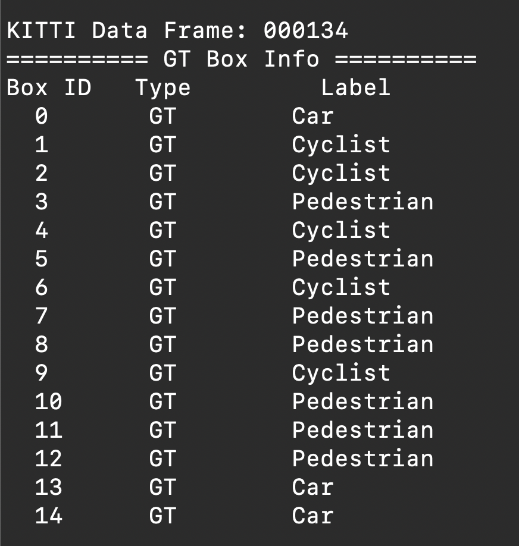 
    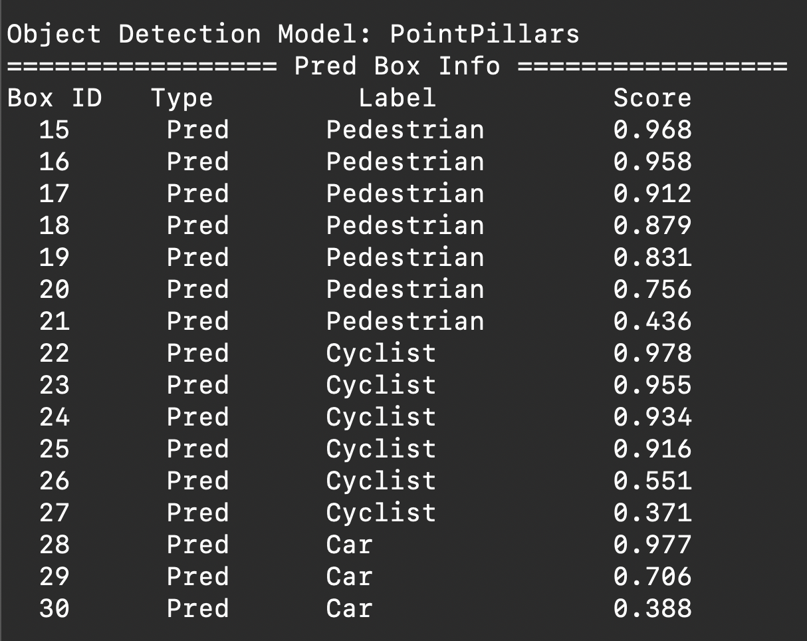
</div>
<div align="center">
    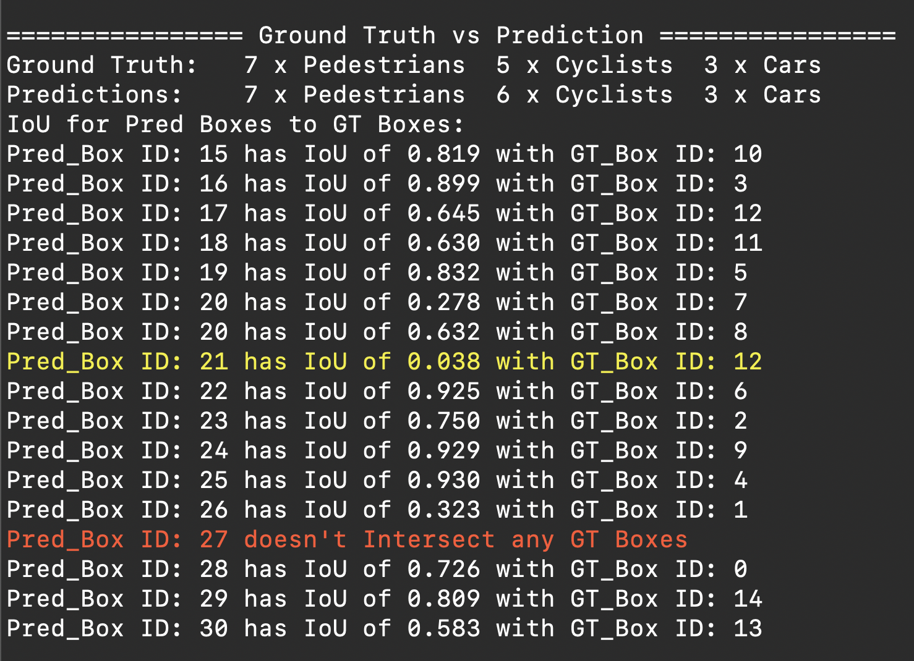 
    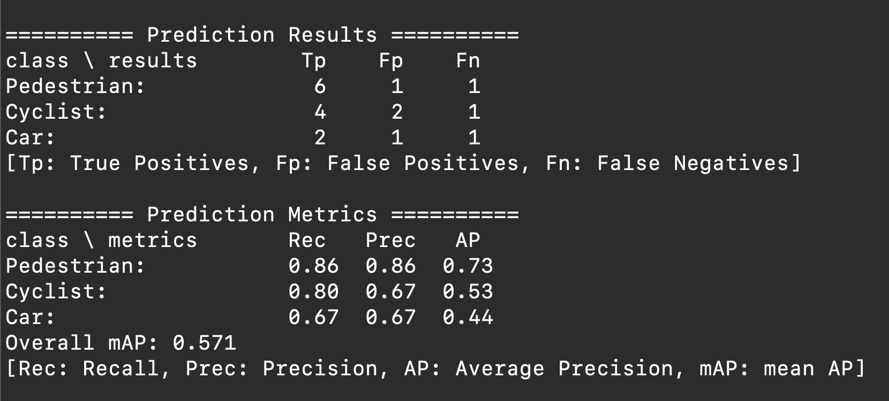
</div>

***

## Attacks

ORA, Spoofing Attack & D-ORA scripts are found in */scripts/attacks/*

```
# File Structure
attacks
    |- ora_attack.py        # From a Target Frame & Box, tries to 
    |                       # remove up to 100 and 200 points within 
    |                       # GT defined boxes
    |
    |- spoofing_attack.py   # From a Target Frame & Box, tries to move  
    |                       # up to 200 points of GT defined box to the 
    |                       # Front-near with reference to [0, 0, 0]
    |
    |- dora_attack.py       # From a Target Frame, tries to removes up
                            # to 200 points from a sequence of boxes 
```

### Object Removal Attack

#### *ora_attack.py* usage:

```bash
(virtual_env) $python scripts/attacks/ora_attack.py --help
# Sample Usage:
ora_attack.py --model ['PointPillars', 'PointRCNN'] 
              --dataset_path './sample_datasets/KITTI'
              --frame [0: 000035, 1: 000134, 2: 000200] 
              --target_box [0, 1, ...] # Max idx number of boxes
              [--dataset_split, default='training']
              [--save_pcd, choices=[0, 1]] # 0: Dont Save, 1: Save 
              [--save_path] # Path to Save Spoofed PCD
              [--config_path]
              [--ckpt_path] [--device, default='cpu']
              [--print_gt_only, choices=[0, 1]] # 1: Print GT Info Only 
                                                # for reference
```

Sample screen dumps after targeting Frame 2 (000200) Box 1:

```bash
(virtual_env)$ python scripts/attacks/ora_attack.py --model 'PointPillars' --dataset_path './sample_datasets/KITTI' --frame 2 --target_box 1 --save_pcd 1 --save_path './sample_datasets/Adv_Kitti' --config_path ./configs/pointpillars.yml --ckpt_path ./pretrained_ckpt/pointpillars.pth --device 'cpu' --print_gt_only 0
```

<div align="center">
    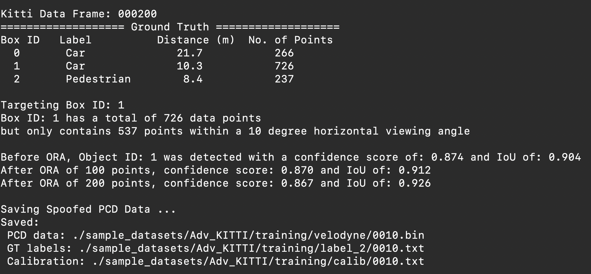 
</div>

### Spoofing Attack

#### *spoofing_attack.py* usage:

```bash
(virtual_env)$ python scripts/attacks/spoofing_attack.py --help
# Sample Usage:
spoofing_attack.py --model ['PointPillars', 'PointRCNN'] 
                   --dataset_path './sample_datasets/KITTI'
                   --frame [0: 000035, 1: 000134, 2: 000200] 
                   --target_box [0, 1, ...] # Max idx number of boxes
                   [--dataset_split, default='training']
                   [--visualize, choices=[0, 1]] # 1: Visualize           
                   [--save_pcd, choices=[0, 1]] # 0: Dont Save, 1: Save 
                   [--save_path] # Path to Save Spoofed PCD
                   [--config_path]
                   [--ckpt_path] [--device, default='cpu']
                   [--print_gt_only, choices=[0, 1]] # 1: Print GT Info Only 
                                                     # for reference
```

Sample for Targeting Frame 1 (000035) Box 0:

```bash
(virtual_env)$ python scripts/attacks/spoofing_attack.py --model 'PointPillars' --dataset_path './sample_datasets/KITTI' --frame 0 --target_box 0 --visualize 1 --save_pcd 1 --save_path './sample_datasets/Adv_Kitti' --config_path ./configs/pointpillars.yml --ckpt_path ./pretrained_ckpt/pointpillars.pth --device 'cpu' --print_gt_only 0
```

<div align="center">
    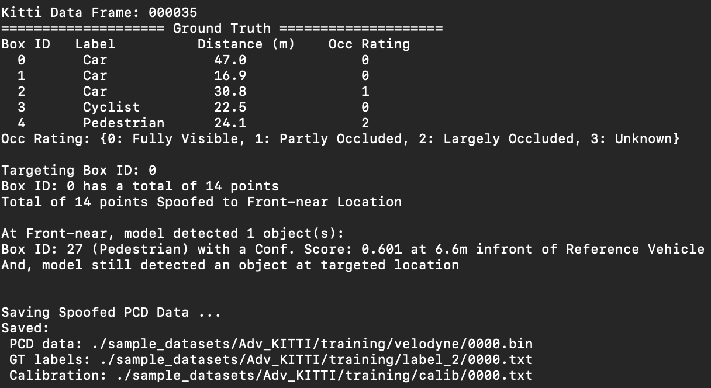 
</div>

<div align="center">
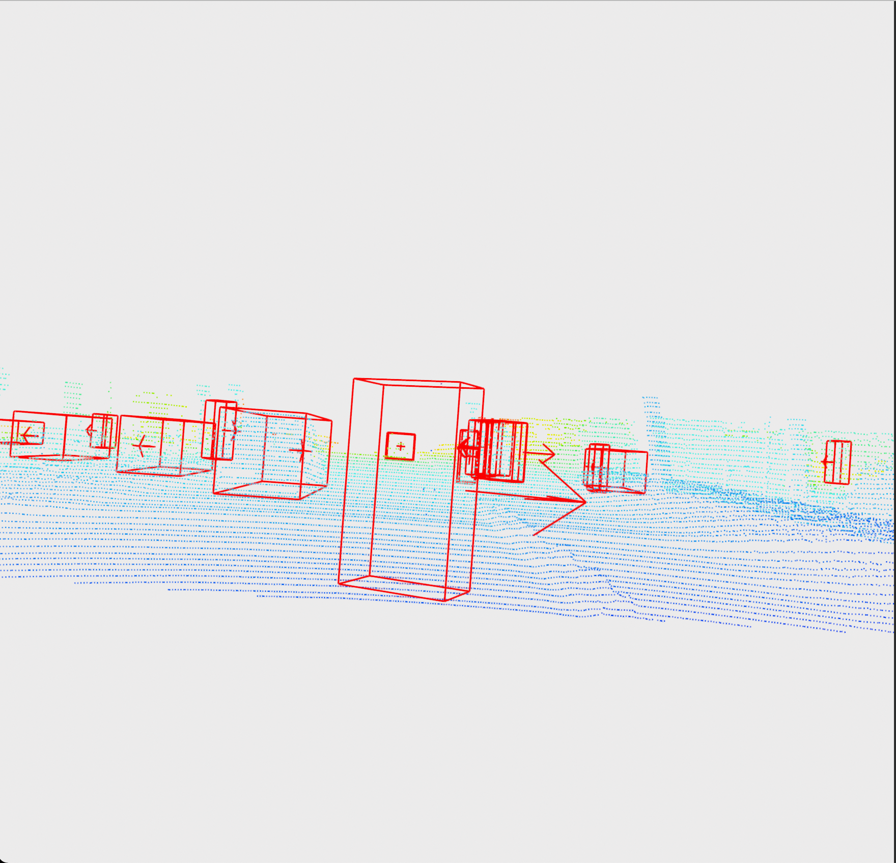 
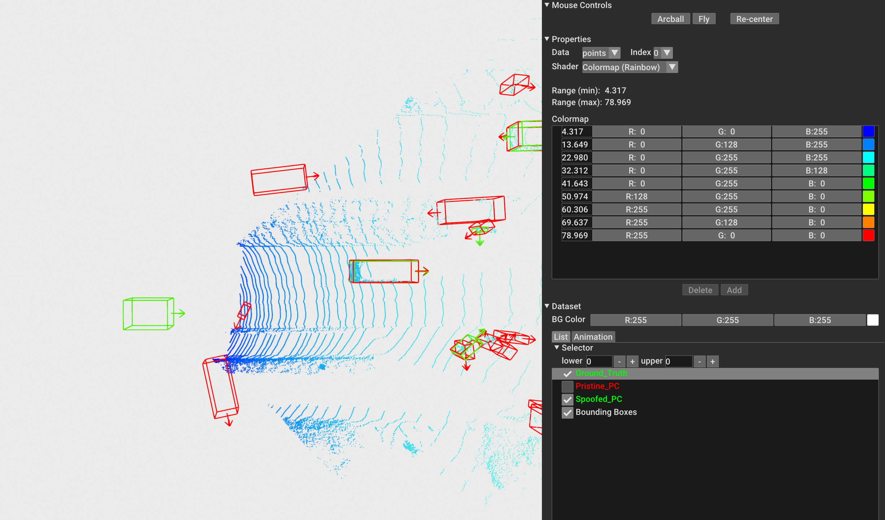
</div>

### Distributed Object Removal Attack

#### *dora_attack.py* usage:

```bash
(virtual_env)$ python scripts/attacks/dora_attack.py --help
# Sample Usage:
dora_attack.py --model ['PointPillars', 'PointRCNN'] 
               --dataset_path './sample_datasets/KITTI'
               --frame [0: 000035, 1: 000134, 2: 000200] 
               [--dataset_split, default='training']
               [--save_pcd, choices=[0, 1]] # 0: Dont Save, 1: Save 
               [--save_path] # Path to Save Spoofed PCD
               [--config_path]
               [--ckpt_path] [--device, default='cpu']
```

Sample for Targeting Frame 1 (000134):

```bash
(virtual_env)$ python scripts/attacks/dora_attack.py --model 'PointPillars' --dataset_path './sample_datasets/KITTI' --frame 1 --save_pcd 1 --save_path './sample_datasets/Adv_Kitti' --config_path ./configs/pointpillars.yml --ckpt_path ./pretrained_ckpt/pointpillars.pth --device 'cpu'
```

<div align="center">
    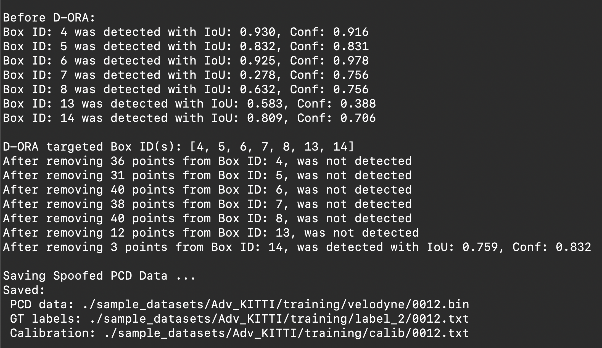 
</div>

***

## Defences (Shadow-Catcher)

Shadow-Catcher analyses PCD for a region located behind boxes and weights the points. Overall returning a total score for the region and categorizes if spoofed object is anomalous.All files can be found in */scripts/shadow_catcher/*. We can use *shadow_catcher.py* on adversarial data saved in sample dataset.

Sample Images of a genuine shadow region and its corresponding object:

<div align="center">
    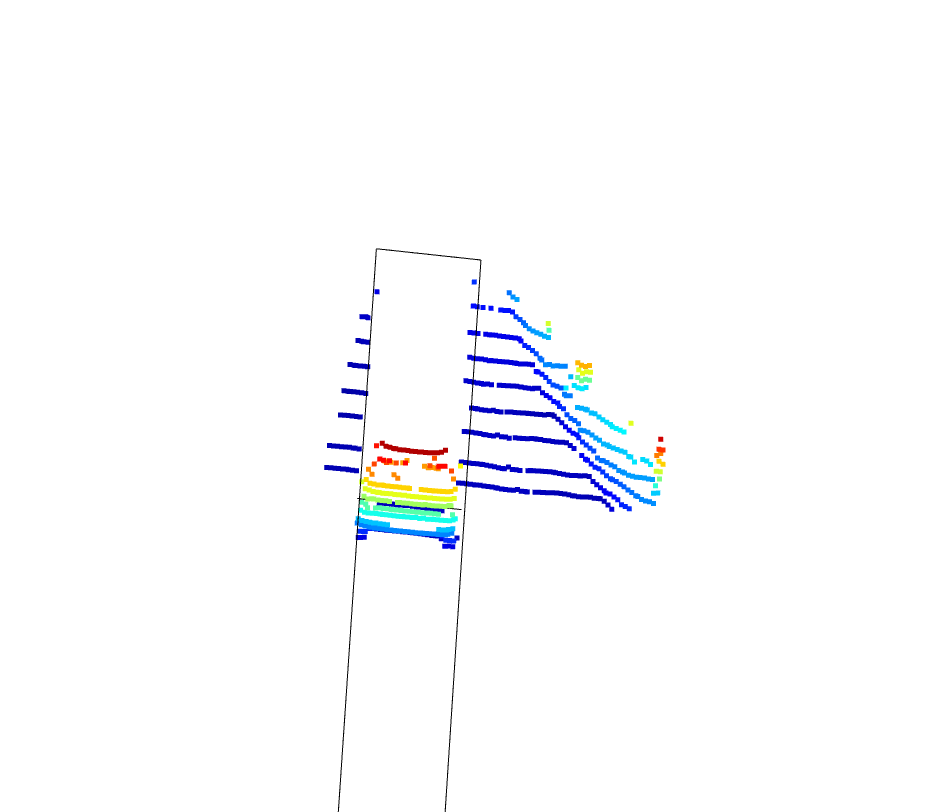
    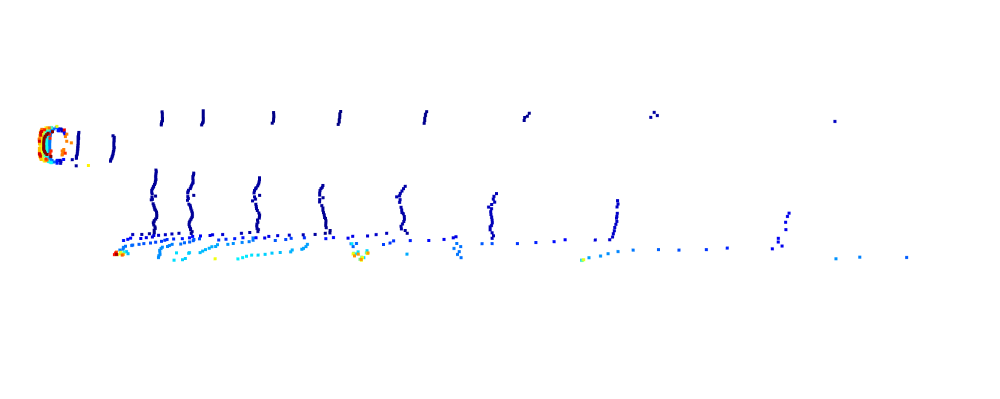 
</div>

```
# File Structure
shadow_catcher
    |- classification.py    # Contains functions to classify shadow 
    |                       # region                       
    |
    |- polygon.py           # Line Class, Vector Class & Face Class  
    |                       # defined for creating shadow lines
    |
    |- shadow.py            # Functions to build shadow region
    |
    |- shadow_catcher.py    # Main file to execute
```

#### *shadow_catcher.py* usage:

```bash
(virtual_env)$ python scripts/shadow_catcher/shadow_catcher.py --help
# Sample Usage:
dora_attack.py --model ['PointPillars', 'PointRCNN'] 
               --dataset_path './sample_datasets/Adv_Kitti'
               --frame [0: 000035, 1: 000134, 2: 000200] 
               [--visualize, choice=[0, 1]] # Visualizing Anomalies Detected
               [--dataset_split, default='training']
               [--config_path]
               [--ckpt_path] [--device, default='cpu']
```

Sample for analysing Adversarial Kitti Frame 0002:

```bash
(virtual_env)$ python scripts/shadow_catcher/shadow_catcher.py --model 'PointPillars' --dataset_path './sample_datasets/Adv_Kitti' --frame 2 --visualize 1 --config_path ./configs/pointpillars.yml --ckpt_path ./pretrained_ckpt/pointpillars.pth --device 'cpu'
```

Screen dump of Results:

<div align="center">
    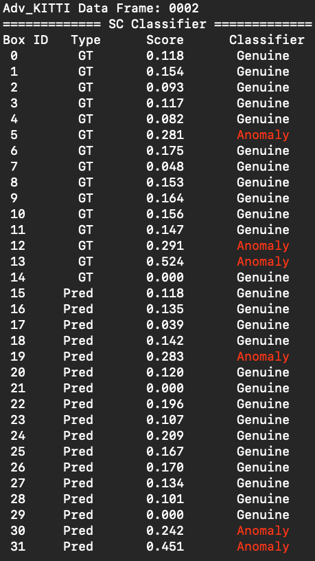
</div>

Anomaly for Spoofed Front-near Box Box 30 (FV):

<div align="center">
    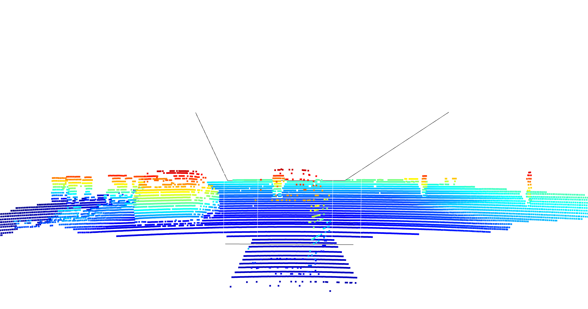 
</div>

***
## References

1. Z.Y. Hau, Kenneth T. Co, Soteris Demetriou, and Emil C. Lupu. Object Removal Attacks on LiDAR-based 3D Object Detectors. CoRR, abs/2102.03722, 2021. URL https://arxiv.org/abs/2102.03722.

2. Yulong Cao, Chaowei Xiao, Benjamin Cyr, Yimeng Zhou, Won Park, Sara Rampazzi, Qi Alfred Chen, Kevin Fu, and Z. Morley Mao. Adversarial Sensor Attack on LiDAR-based Perception in Autonomous Driving. Proceedings of the 2019 ACM SIGSAC Conference on Computer and Communications Security, Nov 2019. doi: 10.1145/3319535.3339815. URL http://dx.doi.org/10.1145/ 3319535.3339815.

3. Zhongyuan Hau, Soteris Demetriou, Luis Mu˜noz-Gonz´alez, and Emil C. Lupu. Ghostbuster: Looking into shadows to detect ghost objects in autonomous vehicle 3d sensing. CoRR, abs/2008.12008, 2020. URL https://arxiv.org/abs/2008.12008.

4. Jian-Yi Zhou, Jaesik Park, and Vladlen Koltun. Open3D: A modern library for 3D data processing. URL https://arXiv:1801.09847, 2018. 27

5. Kitti Benchmarrk Suite URL http://www.cvlibs.net/datasets/kitti/eval_object.php?obj_benchmark=3d.

6. Alex H. Lang, Sourabh Vora, Holger Caesar, Lubing Zhou, Jiong Yang, and Oscar Beijbom. Pointpillars: Fast encoders for object detection from point clouds. CoRR, abs/1812.05784, 2018. URL http://arxiv.org/abs/1812.05784.

7. Shaoshuai Shi, Xiaogang Wang, and Hongsheng Li. PointRCNN: 3D Object Proposal Generation and Detection from Point Cloud. CoRR, abs/1812.04244, 2018. URL http://arxiv.org/abs/1812.04244.

[1]: <https://arxiv.org/abs/2102.03722> "Object Removal"
[2]: <https://arxiv.org/abs/1907.06826> "Object Spoofing" 
[3]: https://arxiv.org/abs/2008.12008 "Shadow Catcher" 
[4]: https://github.com/isl-org/Open3D "Open3D"
[5]: http://www.cvlibs.net/datasets/kitti/index.php "Kitti Dataset"
[6]: https://github.com/nutonomy/second.pytorch "PointPillars" 
[7]: https://github.com/sshaoshuai/PointRCNN "PointRCNN"